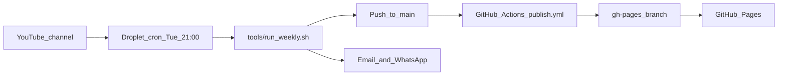

# Corridor of Uncertainty

Companion website for [*The Corridor of Uncertainty*](https://www.youtube.com/@CorridorOfUncertainty) — a podcast at the intersection of maths and sport, hosted by Dr Jess Hargreaves and Dr Rich Bingham (Department of Mathematics, University of York).

**Live site:** [https://areeslindley.github.io/corridor-of-uncertainty/](https://areeslindley.github.io/corridor-of-uncertainty/)

---

## Site pages

The site is a [Quarto](https://quarto.org/) website. Source files are `.qmd` (Quarto Markdown); GitHub Actions renders them to static HTML on publish.

| Page | Source | URL |
|---|---|---|
| Home | `index.qmd` | [/corridor-of-uncertainty/](https://areeslindley.github.io/corridor-of-uncertainty/) |
| About | `about.qmd` | [/about.html](https://areeslindley.github.io/corridor-of-uncertainty/about.html) |
| Upcoming | `upcoming.qmd` | [/upcoming.html](https://areeslindley.github.io/corridor-of-uncertainty/upcoming.html) |
| Episodes index | `episodes/index.qmd` | [/episodes/](https://areeslindley.github.io/corridor-of-uncertainty/episodes/) |
| Individual episodes | `episodes/episode-NNN.qmd` | e.g. [/episodes/episode-021.html](https://areeslindley.github.io/corridor-of-uncertainty/episodes/episode-021.html) |

Navigation, theme, and render scope are configured in [`_quarto.yml`](_quarto.yml). The `tools/` directory is excluded from the published site.

### Episode pages

Each episode is a Quarto page with YAML front matter linking it to the YouTube video:

```yaml
---
title: "Episode 21: Who Will Win the World Cup? Can Maths Decide?"
date: 2026-06-08
description: "…"
categories: [Football, Probability, …]
youtube_id: "97BXpVMZzCk"
---
```

The body typically includes an embedded player, summary, key quotes, and links. The automation in `tools/` matches episodes to videos by `youtube_id` in front matter (not by filename or title), so re-runs stay idempotent.

---

## Deployment workflow

The droplet does **not** host the website. It generates episode pages and pushes them to GitHub; GitHub Actions builds and publishes the static site.



### 1. Weekly automation (droplet)

A cron job on a DigitalOcean droplet runs every **Tuesday at 21:00 Europe/London**:

```cron
0 21 * * 2 /root/corridor-of-uncertainty/tools/run_weekly.sh
```

Evening rather than morning, because episodes publish on Tuesdays and YouTube auto-captions often lag 30–90 minutes.

Each run:

1. Discovers new channel videos (RSS + YouTube Data API)
2. Compares against existing pages by `youtube_id`
3. Generates missing `.qmd` files (transcript → Anthropic API → validation)
4. Runs `quarto render` as a build gate on new pages
5. Commits and pushes to `main`
6. Sends an email and/or WhatsApp summary

Full setup and configuration: [`tools/README.md`](tools/README.md).

### 2. GitHub Actions (publish)

On every push to `main`, [`.github/workflows/publish.yml`](.github/workflows/publish.yml) runs:

1. Checks out the repository
2. Installs Quarto
3. Renders the full site and pushes to the `gh-pages` branch

No separate deploy step is needed — pushing episode content to `main` is enough. The live URL updates a few minutes later.

You can also trigger a rebuild manually from the GitHub Actions tab (**workflow_dispatch**).

### 3. GitHub Pages

The `gh-pages` branch is served at:

**https://areeslindley.github.io/corridor-of-uncertainty/**

Repository: [github.com/areeslindley/corridor-of-uncertainty](https://github.com/areeslindley/corridor-of-uncertainty)

---

## Local development

Preview the site locally:

```bash
quarto preview
```

Render without publishing:

```bash
quarto render
```

Run the automation tooling tests:

```bash
python3 -m venv .venv
.venv/bin/pip install -r tools/requirements.txt
.venv/bin/python -m pytest tools/ -q
```

---

## Repository layout

```
corridor-of-uncertainty/
├── index.qmd              # Home page (latest episodes listing)
├── about.qmd
├── upcoming.qmd
├── episodes/
│   ├── index.qmd          # All episodes listing
│   └── episode-NNN.qmd    # One page per episode
├── _quarto.yml            # Site configuration
├── .github/workflows/
│   └── publish.yml        # Render → gh-pages on push to main
└── tools/                 # Weekly automation (not published)
    ├── run_weekly.sh      # Cron wrapper
    ├── weekly_update.py   # Orchestrator
    └── README.md          # Automation setup guide
```

---

## Manual edits

You can still add or edit episode pages by hand — commit and push to `main` as usual. The weekly job only generates pages for videos that do not yet have a matching `youtube_id` on the site; it will not overwrite existing pages.
