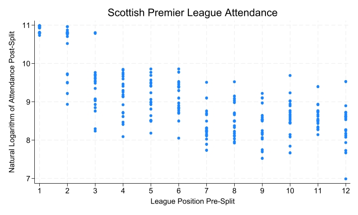
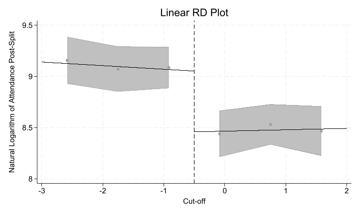
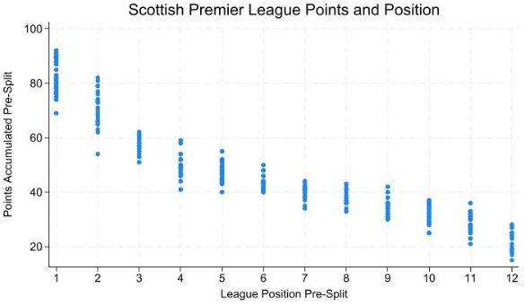
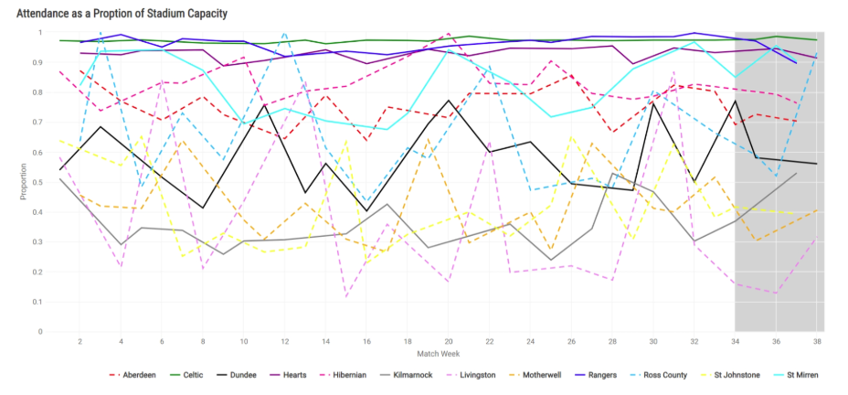

::: {.grid}

::: {.g-col-6}
**Published**: 2025-12-09  
**Duration**: 37:31  
**YouTube**: [Watch here](https://www.youtube.com/watch?v=sgeDr1ykMaI&t=334s)
:::

::: {.g-col-6}
**Topics Covered**: Football, Scottish Premier League, Statistics
:::

:::

## Video

<iframe width="100%" height="400" src="https://www.youtube.com/embed/sgeDr1ykMaI?si=dSLc7mIKrpnNASCZ" frameborder="0" allow="accelerometer; autoplay; clipboard-write; encrypted-media; gyroscope; picture-in-picture" allowfullscreen></iframe>

## Overview

Welcome to the Corridor of Uncertainty, a podcast at the intersection of maths & sport. Hosted by Dr Jess Hargreaves & Dr Rich Bingham, two mathematicians at the University of York.

How fair is Scottish football? In this episode we talk about the Split format in the Scottish Premier League, including some of the unintended consequences.

---

Jess' and Johan's 6-page paper can be found here:

- <https://eprints.whiterose.ac.uk/id/ep...>
- <https://shiny.york.ac.uk/SPLit/>

## Key Concepts

The analysis centres on whether the SPL Split format distorts incentives — particularly whether a team's pre-split league position causally affects their post-split attendance. The scatter below shows the relationship between pre-split position and post-split attendance (on a log scale), motivating the need for a more rigorous causal approach.

{fig-alt="Scatter plot of SPL attendance (log scale) against league position pre-split, showing a general negative relationship with considerable spread." width="100%"}

::: {.callout-tip}
## The SPL Split Format
The Scottish Premier League uses a mid-season "split" after 33 matches: the top six teams play each other for European places and the title, while the bottom six contest relegation. Although designed to keep late-season fixtures meaningful, the format creates a sharp discontinuity in competitive incentives around the 6th/7th place boundary — teams just above and just below the cut-off face very different post-split schedules despite having accumulated nearly identical points.
:::

::: {.callout-tip}
## Regression Discontinuity Design
Regression Discontinuity (RD) is a quasi-experimental method for estimating causal effects when treatment is assigned by whether a continuous "running variable" crosses a known threshold. Here, pre-split league position is the running variable and finishing in the top six is the treatment. By comparing teams just above and just below the cut-off — who are otherwise very similar — it is possible to isolate the causal effect of split placement on post-split attendance, rather than simply observing a correlation. The plot below shows the estimated discontinuity in log-attendance at the split boundary (cut-off = 0), with 95% confidence bands.

{fig-alt="Linear regression discontinuity plot with natural log of attendance on the y-axis and normalised cut-off on the x-axis, showing a downward jump at the threshold." width="100%"}
:::

## Interactive Demonstration

This interactive visualisation demonstrates how points are distributed across teams in a typical Scottish Premier League season, illustrating the competitive balance that the split format addresses.

```{=html}
<div>
  <script type="text/javascript">window.PlotlyConfig = {MathJaxConfig: 'local'};</script>
  <script charset="utf-8" src="https://cdn.plot.ly/plotly-2.29.1.min.js"></script>
  <div id="spl-plot" class="plotly-graph-div" style="height:600px; width:100%;"></div>
  <script type="text/javascript">
    window.PLOTLYENV=window.PLOTLYENV || {};
    if (document.getElementById("spl-plot")) {
      Plotly.newPlot(
        "spl-plot",
        [{"alignmentgroup":"True","hovertemplate":"Total Points=%{marker.color}<br>Team=%{y}<extra></extra>","legendgroup":"","marker":{"color":[26,30,37,38,46,51,52,57,66,69,84,89],"coloraxis":"coloraxis","pattern":{"shape":""}},"name":"","offsetgroup":"","orientation":"h","showlegend":false,"text":[26.0,30.0,37.0,38.0,46.0,51.0,52.0,57.0,66.0,69.0,84.0,89.0],"textposition":"outside","x":[26,30,37,38,46,51,52,57,66,69,84,89],"xaxis":"x","y":["Livingston","St. Johnstone","Ross County","Motherwell","Kilmarnock","St. Mirren","Dundee","Hibernian","Aberdeen","Hearts","Rangers","Celtic"],"yaxis":"y","type":"bar"}],
        {"xaxis":{"anchor":"y","domain":[0.0,1.0],"title":{"text":"Total Points"}},"yaxis":{"anchor":"x","domain":[0.0,1.0],"title":{"text":""},"categoryorder":"total ascending"},"coloraxis":{"colorbar":{"title":{"text":"Total Points"}},"colorscale":[[0.0,"rgb(165,0,38)"],[0.1,"rgb(215,48,39)"],[0.2,"rgb(244,109,67)"],[0.3,"rgb(253,174,97)"],[0.4,"rgb(254,224,139)"],[0.5,"rgb(255,255,191)"],[0.6,"rgb(217,239,139)"],[0.7,"rgb(166,217,106)"],[0.8,"rgb(102,189,99)"],[0.9,"rgb(26,152,80)"],[1.0,"rgb(0,104,55)"]]},"legend":{"tracegroupgap":0},"title":{"text":"Scottish Premier League Points Distribution (Example Season)"},"barmode":"relative","shapes":[{"line":{"color":"red","dash":"dash"},"type":"line","x0":51,"x1":51,"xref":"x","y0":0,"y1":1,"yref":"y domain"}],"annotations":[{"showarrow":false,"text":"Split Line (Top 6 / Bottom 6)","x":51,"xanchor":"center","xref":"x","y":1,"yanchor":"bottom","yref":"y domain"}],"height":600,"showlegend":false,"hovermode":"closest"},
        {"responsive": true}
      )
    };
  </script>
</div>
```

The scatter below complements the interactive chart by showing how points accumulated pre-split vary across all 12 league positions across multiple seasons, illustrating the degree of overlap near the cut-off that makes the RD approach credible.

{fig-alt="Scatter plot of pre-split points accumulated against league position for all 12 SPL teams, showing decreasing points with lower position and notable overlap near the split boundary." width="100%"}

This visualisation shows:

- **Interactive features**: Hover over bars to see exact point values
- **Colour coding**: Teams are colour-coded by points (green = higher, red = lower)
- **Split indicator**: The dashed line shows where the league typically splits into top and bottom halves

## Resources & References

- Hargreaves, J. & [co-author]: *The SPLit — fairness in the Scottish Premier League* — <https://eprints.whiterose.ac.uk/id/ep...>
- Interactive SPLit tool: <https://shiny.york.ac.uk/SPLit/>


:::

## Discussion

Beyond the causal question of whether split placement affects attendance, the episode also examines how consistently teams fill their stadiums across the full season. The chart below tracks each club's attendance as a proportion of stadium capacity match-by-match, with the shaded region indicating the post-split period. The stark divergence between clubs — Celtic and Rangers consistently near capacity, some sides regularly below 50% — contextualises why the commercial stakes of split placement differ so dramatically between the top and bottom of the table.

{fig-alt="Line chart showing attendance as a proportion of stadium capacity across the SPL season for all 12 clubs, with the post-split period shaded in grey." width="100%"}

The SPLit paper is a nice example of RD design being applied in a sports context where a clean threshold exists naturally in the competition structure. The same logic could extend to other split or playoff formats — the A-League, the Danish Superliga, or even promotion play-offs — wherever a discrete cut-off generates a discontinuity in incentives or outcomes that would otherwise be confounded with underlying team quality.

::: {.callout-note}
## Related Episodes
- [Episode X: Related Topic](episode-00X.qmd)
- [Episode Y: Follow-up Topic](episode-00Y.qmd)
:::

---

::: {.grid}

::: {.g-col-6}
[⬅️ Back to Episodes](index.qmd)
:::

::: {.g-col-6 .text-end}
[➡️ Episode 2](episode-002.qmd)
:::

:::
