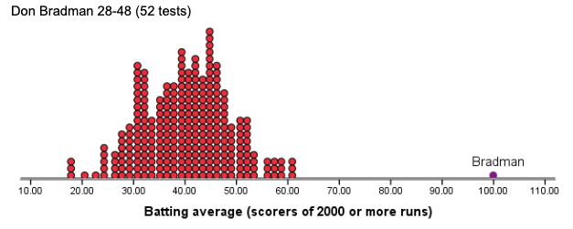
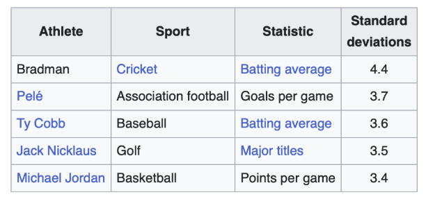

::: {.grid}

::: {.g-col-6}
**Published**: 17 December 2025  
**Duration**: 34:18  
**YouTube**: [Watch here](https://www.youtube.com/watch?v=fQYV_adrnNI&t=3s)
:::

::: {.g-col-6}
**Topics Covered**: Sports Personality of the Year, Award Statistics, Sport Rankings, Voting Patterns
:::

:::

## Video

<iframe width="100%" height="400" src="https://www.youtube.com/embed/fQYV_adrnNI" frameborder="0" allow="accelerometer; autoplay; clipboard-write; encrypted-media; gyroscope; picture-in-picture" allowfullscreen></iframe>

## Overview

In this festive Christmas special, Jess puts Rich through a Sports Personality of the Year quiz with a mathematical twist. The episode dives into the historical data behind the BBC's annual sports award, examining patterns in winners by sport, nationality, and gender. Along the way, they uncover some surprising statistics and reveal their personal grievances about past voting results.

---

**Timestamps:**

- [00:19] Introduction and episode setup
- [01:01] SPOTY quiz begins - most wins
- [03:06] Athletes who have won twice
- [06:00] Most placings without winning
- [10:00] Geographic breakdown of winners
- [14:00] Discussion of this year's nominees

**References:**

- BBC Sports Personality of the Year historical data

## Key Concepts

::: {.callout-tip}
## Counting Placements vs Wins
The episode introduces the idea of ranking athletes by total podium placements rather than just wins — similar to how Olympic medal tables count total medals. This reveals athletes like Jessica Ennis-Hill who consistently placed highly (one second, three thirds) but never won the award.
:::

::: {.callout-tip}
## Nested Tree Diagrams for Categorical Data
Jess presents a nested tree diagram showing SPOTY winners by UK nation and then sport within each nation. This visualisation technique reveals that Scotland, Wales, and Northern Ireland show greater diversity across sports compared to England, despite having fewer total winners.
:::

::: {.callout-tip}
## Sport Popularity Bias in Voting
The discussion highlights how individual sports like tennis and Formula One consistently outperform team sports in public voting, with three of the four two-time winners being F1 drivers. This suggests systematic biases in how the public perceives and votes for sporting achievement.
:::

::: {.callout-tip}
## Z-Score Normalisation for Cross-Sport Comparison
One principled response to the challenge of comparing athletes across different sports is to standardise each athlete's performance metric within their sport — computing a z-score as the number of standard deviations above the mean of all competitors in that discipline. This removes the effect of sport-specific scale and variance, placing, say, a batting average and a goals-per-game ratio on a common footing. The figure below illustrates just how extreme Don Bradman's Test batting average of 99.94 is relative to all other batters who have scored 2,000 or more runs — a visual demonstration of what a 4.4 SD outlier looks like in practice.

{fig-alt="Dot plot histogram of batting averages showing a roughly bell-shaped distribution centred around 35-45, with a single isolated point labelled Bradman at just over 100." width="100%"}
:::

## Resources & References

- BBC Sports Personality of the Year archive
- Dr Emma Ross's research on elite athletes and motherhood (mentioned)

## Transcript Highlights

> "We're coming to the real reason we started this podcast, which is to try and expose our grudges in sport and to try and back them up with some kind of data."

Jess reveals the true motivation behind the podcast while discussing Jessica Ennis-Hill's controversial third-place finishes.

---

> "If you think about it a bit like if you were doing an Olympic medals table... who has had the most placings without winning it?"

This reframing of the question leads to the discovery that Jessica Ennis-Hill has been consistently nominated but overlooked for the top prize.

---

> "Jessica Ennis gives birth in July 2014. Wins the World Championship August 2015. That's why I think she beats Kevin Sinfield."

Jess makes an impassioned case for why Ennis-Hill deserved the 2015 award over Andy Murray's Davis Cup victory.

## Discussion

This episode demonstrates how simple descriptive statistics can reveal patterns in subjective voting that might otherwise go unnoticed. By examining SPOTY data through the lens of total placements, sport categories, and geographic distribution, Jess and Rich uncover systematic biases in how the British public values different sporting achievements. The finding that motorsport dominates the two-time winners list, while team sport athletes and those from athletics struggle to convert nominations into wins, raises important questions about how we collectively evaluate sporting excellence.

The discussion also touches on a broader theme in sports analytics: the challenge of comparing achievements across fundamentally different sports. How do you weigh a Davis Cup tennis victory against a World Championship won months after childbirth? The SPOTY voting system essentially crowdsources this impossible comparison, but the resulting patterns suggest that some sports benefit from greater visibility and individual narratives rather than pure athletic achievement.

The z-score framework offers one objective answer to this question. The boxplot below shows the distribution of standardised performance scores across seven sports, with labelled outliers identifying the athletes whose dominance is most statistically extraordinary relative to their peers. Bradman's z-score of 6.4 in cricket dwarfs all others — roughly two standard deviations above the next most dominant athlete across any sport in the comparison.

{fig-alt="Boxplot of z-scores by sport including cricket, football, Formula 1, golf, men's tennis, rugby union, and women's tennis. Most distributions are centred near zero with Bradman as a clear outlier above 6 standard deviations in cricket." width="100%"}

The table below ranks the top five athletes by this standardised metric across sports, reinforcing Bradman's exceptional status while also highlighting how Pelé, Ty Cobb, Jack Nicklaus, and Michael Jordan stand out within their respective disciplines.

{fig-alt="Table with columns for athlete, sport, statistic, and standard deviations. Five rows list Bradman, Pelé, Ty Cobb, Jack Nicklaus, and Michael Jordan in descending order of standard deviations." width="100%"}

Whether this kind of analysis should inform something like SPOTY voting is a different and murkier question — public awards blend statistical achievement with narrative, timing, and national sentiment in ways that a z-score cannot capture. But it at least provides a principled baseline against which the subjectivity of the vote can be measured.

::: {.callout-note}
## Related Episodes
- [Episode 1: The SPLit — How fair is Scottish Football?](episode-001.qmd)
:::

---

::: {.grid}

::: {.g-col-6}
[⬅️ Episode 1](episode-001.qmd)
:::

::: {.g-col-6 .text-end}
[➡️ Episode 3](episode-003.qmd)
:::

:::
