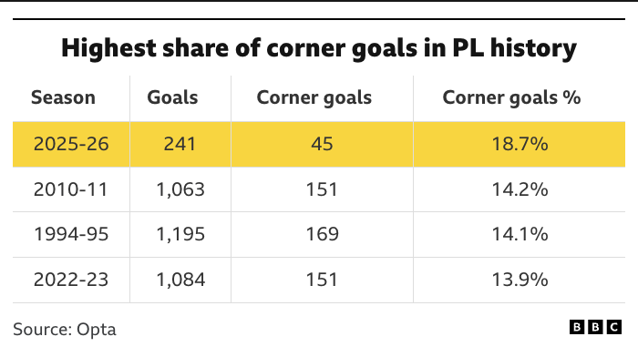
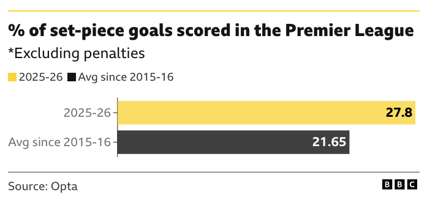
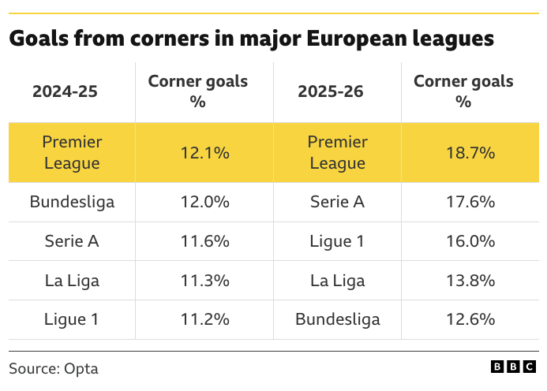
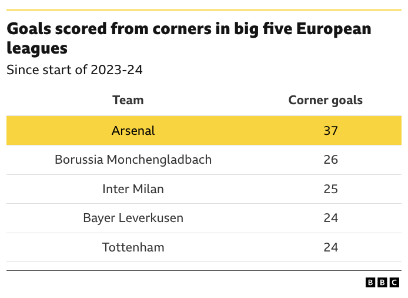
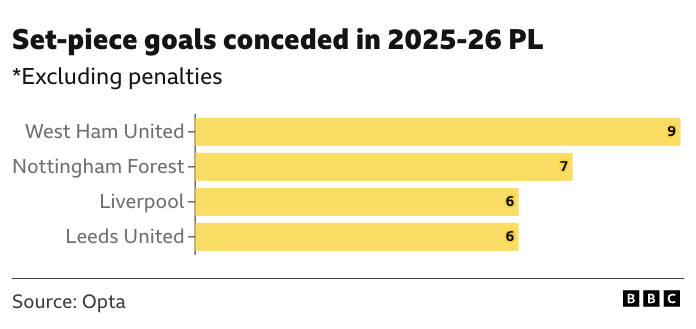

::: {.grid}

::: {.g-col-6}
**Published**: 24 December 2025  
**Duration**: 47:27  
**YouTube**: [Watch here](https://www.youtube.com/watch?v=L4TlGfVxhFg&t=4s)
:::

::: {.g-col-6}
**Topics Covered**: Statistic of the Year, Cycling, Set-Piece Football, Pole Vault, Women's Cricket, Baseball, Women's Cycling
:::

:::

## Video

<iframe width="100%" height="400" src="https://www.youtube.com/embed/L4TlGfVxhFg" frameborder="0" allow="accelerometer; autoplay; clipboard-write; encrypted-media; gyroscope; picture-in-picture" allowfullscreen></iframe>

## Overview

In this episode, Jess and Rich introduce their own "Sports Statistic of the Year" award, inspired by the Royal Statistical Society's annual initiative. They explore how a single number can encapsulate an entire year in sport, using the RSS's 2021 winner (53% of Team GB athletes at Tokyo 2020 being female) as an example. The nominations span cycling, football, athletics, cricket, baseball, and women's road racing — from Pogačar's extraordinary power output on Hautacam to a record-breaking season for Premier League set-piece goals.

---

**Timestamps:**

- [00:17] Introduction and episode concept
- [01:37] Background on the Royal Statistical Society's Statistic of the Year
- [03:16] RSS 2021 winner: 53% female athletes at Tokyo 2020
- [04:30] Nomination: Pogačar's 6.7 W/kg on Hautacam
- [08:00] Nomination: Premier League set-piece goals in 2025–26
- [14:00] Nomination: Armand Duplantis — 14 world records
- [20:00] Nomination: Phoebe Litchfield's reverse sweep statistics
- [28:00] Nomination: Shohei Ohtani's NLCS Game 4
- [36:00] Nomination: Marianne Vos and Mavi Garcia at Tour de France Femme 2025

**References:**

- [Royal Statistical Society — Statistic of the Year](https://rss.org.uk/news-publication/news-publications/2021/general-news/statistics-of-the-year-2021-announced/)
- Berg, O.K. (2025). *Journal of Science and Cycling* — [Pogačar Hautacam power analysis](https://www.jsc-journal.com/index.php/JSC/article/view/1054/854)
- [BBC Sport — Set-piece goals in the PL](https://www.bbc.co.uk/sport/football/articles/c781zwgx419o) (28 October 2025)
- [GiveMeSport — PL set-piece goals tracker](https://www.givemesport.com/premier-league-set-piece-goals/)
- Royal Statistical Society Statistics and Sports Section

## Key Concepts

::: {.callout-tip}
## Statistic as Time Capsule
The episode explores the idea that a well-chosen statistic can serve as a "time capsule" for an entire year in sport. Unlike technical statistical distributions, these are single numbers that encapsulate significant moments, trends, or achievements — the RSS's 2021 winner (53% of Team GB athletes at Tokyo 2020 being female) being a prime example of a figure that tells a story well beyond the raw number itself.
:::

::: {.callout-tip}
## Pogačar's Power Output — 6.7 W/kg on Hautacam
At Stage 12 of the 2025 Tour de France, Tadej Pogačar sustained 441 watts (6.7 W/kg at 66 kg) for approximately 33 minutes on the Hautacam climb — 13 km at 8% gradient (1,200 m of elevation gain) after already racing 167 km. He put 2 minutes 10 seconds into Jonas Vingegaard on the stage alone. Analysed by Ole Kristian Berg of Molde University College, Norway, and published in the *Journal of Science and Cycling*, this power figure sits at the outer edge of what has been recorded in professional road cycling and raises the perennial question of where physiological limits actually lie.
:::

::: {.callout-tip}
## Premier League Set-Piece Goals — A Record-Breaking Season
The 2025–26 Premier League season has seen a historically unusual proportion of goals originating from set-pieces and corners. As of late 2025, 27.8% of all PL goals (excluding penalties) came from set-pieces, compared to an average of 21.65% since 2015–16 — and 33.7% as of 4 January 2026, according to GiveMeSport's running tracker. The figures suggest a structural shift in how teams are exploiting dead-ball situations, with coaching innovation and deliberate corner routines — most visibly associated with Arsenal — playing a central role.
:::

::: {.callout-tip}
## Armand Duplantis — 14 World Records
Swedish-American pole vaulter Armand Duplantis has broken the world record 14 times since his first at 6.17 m in 2020, with the current mark standing at 6.30 m. At 1.8 m tall, his height-to-vault ratio is itself remarkable. He holds two Olympic gold medals and three World Championship titles. The rate of world record progression in pole vault under Duplantis illustrates how a single dominant athlete can shift the distributional upper tail of a sport's performance record — analogous in some ways to the Bradman z-score discussed in Episode 2.
:::

::: {.callout-tip}
## Phoebe Litchfield — The Reverse Sweep
Left-handed batter Phoebe Litchfield (Northern Superchargers in the Women's Hundred) averages 47.0 at a strike rate of 195 when playing the reverse sweep, compared to 41.71 overall (292 runs, 10 innings, 157.83 strike rate batting conventionally). She credits the shot to her background as a hockey player, where all players use right-handed sticks regardless of natural handedness — creating a muscle memory that transfers directly to the unorthodox batting grip. This is a clean example of cross-sport skill transfer producing a statistically measurable advantage.
:::

::: {.callout-tip}
## Shohei Ohtani — NLCS Game 4
In Game 4 of the 2025 NLCS (Los Angeles Dodgers vs Milwaukee Brewers), Shohei Ohtani became the first player in baseball history to hit three home runs and record a strikeout as a pitcher in the same game. As a batter: 3 HR, 1 BB. As a pitcher: 6.0 innings, 10 strikeouts, 0 earned runs (2 hits, 3 walks). The nearest historical precedent is Jim Tobin of the 1942 Boston Braves, who hit three home runs and threw a complete game — but allowed five runs, making Ohtani's combined performance categorically more dominant.
:::

::: {.callout-tip}
## Marianne Vos and Mavi Garcia — Tour de France Femme 2025
The 2025 Tour de France Femme opened with stage victories for two of the oldest riders in the peloton: Marianne Vos (Stage 1, aged 38, with 258 career wins) and Mavi Garcia (Stage 2, aged 41). Together they underscore how peak endurance performance in women's professional cycling extends well beyond what was previously assumed, with important implications for how training, recovery, and career longevity are modelled in sports science.
:::

::: {.callout-tip}
## Optimal Defence vs Fan Experience
The episode also touches on MLB's ban on extreme defensive shifts, which exemplifies the tension between statistically optimal play and entertainment value. As analytical methods make defence increasingly data-driven across sports, leagues face difficult choices about preserving competitive integrity while maintaining fan engagement — a regulatory problem that cricket and football may face in different forms as set-piece and field-placement optimisation continues to develop.
:::

## Resources & References

- Berg, O.K. (2025). Pogačar power analysis. *Journal of Science and Cycling* — <https://www.jsc-journal.com/index.php/JSC/article/view/1054/854>
- Royal Statistical Society Statistic of the Year initiative — <https://rss.org.uk/news-publication/news-publications/2021/general-news/statistics-of-the-year-2021-announced/>
- BBC Sport — PL set-piece goals (28 October 2025) — <https://www.bbc.co.uk/sport/football/articles/c781zwgx419o>
- GiveMeSport — PL set-piece goals tracker — <https://www.givemesport.com/premier-league-set-piece-goals/>
- RSS Statistics and Sports Section
- Apple TV baseball coverage (mentioned for statistical visualisations)
- The Women's Hundred cricket competition

## The Set-Piece Statistics in Detail

The Premier League set-piece nomination is supported by data from Opta and the BBC. The headline figure — 27.8% of goals from set-pieces in 2025–26, against a 21.65% average since 2015–16 — is contextualised below across four charts.

The current season's corner goal share of 18.7% is the highest in Premier League history, surpassing the previous record of 14.2% set in 2010–11.

{fig-alt="Table showing the four highest corner goal percentage seasons in PL history: 2025-26 at 18.7%, 2010-11 at 14.2%, 1994-95 at 14.1%, and 2022-23 at 13.9%." width="100%"}

The broader set-piece picture (which includes free-kicks and long throws, not just corners) shows the 2025–26 figure of 27.8% sitting well above the decade average of 21.65%.

{fig-alt="Horizontal bar chart showing two bars: 2025-26 in yellow at 27.8% and the average since 2015-16 in dark grey at 21.65%." width="100%"}

The trend is not solely a Premier League phenomenon. Across the big five European leagues, corner goal percentages have risen notably in 2025–26 compared to 2024–25, with the PL leading at 18.7% but Serie A (17.6%) and Ligue 1 (16.0%) also elevated.

{fig-alt="Two-column table showing corner goal percentages for Premier League, Bundesliga, Serie A, La Liga, and Ligue 1 in 2024-25 and 2025-26. PL rises from 12.1% to 18.7%." width="100%"}

At club level, Arsenal lead all teams across the big five European leagues since the start of 2023–24, with 37 corner goals — 11 more than the next-highest club (Borussia Mönchengladbach on 26).

{fig-alt="Table of teams ranked by corner goals since 2023-24. Arsenal highlighted in yellow at 37; Borussia Monchengladbach 26, Inter Milan 25, Bayer Leverkusen and Tottenham both 24." width="100%"}

The defensive side of the picture shows West Ham United conceding the most set-piece goals in the 2025–26 PL season (9), ahead of Nottingham Forest (7), Liverpool (6), and Leeds United (6).

{fig-alt="Horizontal bar chart showing set-piece goals conceded by the four highest teams in the 2025-26 PL: West Ham 9, Nottingham Forest 7, Liverpool 6, Leeds United 6." width="100%"}

## Transcript Highlights

> "There's a beautiful skill in terms of taking something like the year of 2025 and representing that in one number."

Jess articulates the core challenge of the Statistic of the Year concept — finding a single figure that meaningfully captures the essence of an entire year in sport.

---

> "Statistics have made you play the sport better. It's making your defense better because you understand where they're going to put the ball... This is actually forcing people to play what we know to be suboptimal defense."

Rich recounts a compelling argument from an MLB pundit about the shift ban, highlighting the philosophical tension between data-driven optimisation and regulatory intervention for entertainment.

---

> "She actually averages higher hitting it the wrong way around... she credits it all to her experience as a hockey player."

Rich explains the cross-sport origin of Phoebe Litchfield's signature shot, demonstrating how athletic backgrounds can create unexpected statistical advantages.

## Discussion

This episode effectively demonstrates how statistics can tell compelling stories about sport beyond simple performance metrics. The nominations span six sports and connect through a common thread: each figure marks the outer boundary of what was previously thought possible — whether that is a cyclist's power output, a vaulter's height, or a batter's average with an unorthodox technique.

The set-piece data is perhaps the most structurally interesting of the nominations from a statistical perspective, because it points to a systemic change in how football is being played rather than an individual exceptional performance. A 27.8% set-piece goal share, and a corner goal record that eclipses anything in 30+ years of Premier League history, suggests the sport may be at a methodological inflection point — one where deliberate corner routines are shifting the expected-goals landscape in ways that have yet to be fully absorbed into tactical doctrine or defensive coaching.

::: {.callout-note}
## Related Episodes
- [Episode 2: Sports Personality of the Year — Can we use stats to rank sports?](episode-002.qmd)
:::

---

::: {.grid}

::: {.g-col-6}
[⬅️ Episode 2](episode-002.qmd)
:::

::: {.g-col-6 .text-end}
[➡️ Episode 4](episode-004.qmd)
:::

:::
